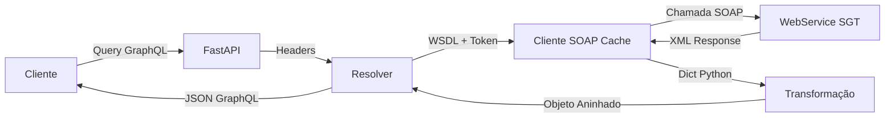

<div align="center">

# 🚀 Multiembarcador GraphQL Facade

### Fachada GraphQL moderna para WebService SOAP SGT

[](https://www.python.org/)
[](https://fastapi.tiangolo.com/)
[](https://graphql.org/)
[](https://strawberry.rocks/)
[](https://python-poetry.org/)
[](https://opensource.org/licenses/MIT)

</div>

---

## 📋 Índice

- [Visão Geral](#-visão-geral)
- [Características](#-características-principais)
- [Stack Tecnológica](#-stack-tecnológica)
- [Instalação](#-instalação)
- [Uso](#-uso)
  - [Interface Playground](#-interface-playground-recomendado)
  - [API GraphQL](#-api-graphql)
- [Exemplos](#-exemplos)
- [Arquitetura](#-arquitetura)
- [Schema GraphQL](#-schema-graphql)
- [Desenvolvimento](#-desenvolvimento)
- [Roadmap](#-roadmap)
- [Contribuindo](#-contribuindo)
- [Licença](#-licença)
- [Autor](#-autor)

---

## 🎯 Visão Geral

Este serviço atua como uma **camada de abstração (facade)** entre clientes modernos que consomem GraphQL e um webservice SOAP legado. Projetado especificamente para facilitar consultas e migrações de dados entre diferentes ambientes (Produção, Desenvolvimento, etc.).

### Por que usar?

- ✅ **Modernização**: Transforme APIs SOAP legadas em GraphQL moderno
- ✅ **Flexibilidade**: Consulte apenas os dados que você precisa
- ✅ **Multi-ambiente**: Alterne entre ambientes via headers HTTP
- ✅ **Performance**: Cache LRU inteligente para clientes WSDL
- ✅ **Developer Experience**: Interface web interativa para testes

---

## ✨ Características Principais

| Característica | Descrição |
|----------------|-----------|
| 🔄 **Configuração Dinâmica** | URL do WSDL e token configuráveis por requisição via headers |
| 🎨 **Transformação de Dados** | Converte respostas SOAP planas em objetos GraphQL aninhados |
| ⚡ **Cache Inteligente** | Cliente SOAP com cache LRU para otimizar performance |
| 🎮 **Interface Interativa** | Playground web com suporte a headers customizados |
| 📊 **API Moderna** | Interface GraphQL limpa e intuitiva |
| 🔍 **Type-Safe** | Schema GraphQL completamente tipado |

---

## 🛠 Stack Tecnológica

<div align="center">

| Tecnologia | Versão | Uso |
|------------|--------|-----|
| **Python** | 3.10+ | Linguagem principal |
| **Poetry** | Latest | Gerenciamento de dependências |
| **FastAPI** | 0.121+ | Framework web assíncrono |
| **Strawberry GraphQL** | 0.285+ | Framework GraphQL para Python |
| **Zeep** | 4.3+ | Cliente SOAP/WSDL |
| **Uvicorn** | 0.38+ | Servidor ASGI |

</div>

---

## 📦 Instalação

### Pré-requisitos

- Python 3.10 ou superior
- Poetry (gerenciador de dependências Python)

### Setup Rápido

```bash
# 1. Clone o repositório
git clone https://github.com/flaviohbonfim/multiembarcador-graphql-facade.git
cd multiembarcador-graphql-facade

# 2. Instale as dependências
poetry install

# 3. Inicie o servidor
poetry run uvicorn src.main:app --host 127.0.0.1 --port 8000 --reload
```

✅ Servidor disponível em: `http://127.0.0.1:8000`

---

## 🚀 Uso

### 🎮 Interface Playground (Recomendado)

A forma mais fácil de testar a API é através da **interface web interativa**:

```
🌐 http://127.0.0.1:8000/playground
```

#### Funcionalidades do Playground:

- ✅ **Configuração de Headers**: Campos dedicados para `X-Target-WSDL` e `X-Auth-Token`
- ✅ **Editor de Queries**: Syntax highlighting e autocompletar
- ✅ **Execução Rápida**: Botão "Executar" ou atalho `Ctrl+Enter`
- ✅ **Resultados Formatados**: JSON colorido com indicadores de sucesso/erro
- ✅ **Query de Exemplo**: Exemplo pré-carregado para começar rapidamente

<div align="center">


</div>

### 📡 API GraphQL

#### Endpoints Disponíveis

| Endpoint | Método | Descrição |
|----------|--------|-----------|
| `/` | GET | Informações sobre a API |
| `/graphiql` | GET | **GraphiQL** - Documentação interativa do Schema (Docs Explorer) |
| `/playground` | GET | **Playground** - Interface de testes com suporte a headers |
| `/graphql` | POST | API GraphQL (endpoint de produção) |

#### Headers Obrigatórios

Todas as requisições para `/graphql` devem incluir:

```http
X-Target-WSDL: https://braveo.multiembarcador.com.br/SGT.WebService/Cargas.svc?wsdl
X-Auth-Token: seu-token-aqui
```

### 📚 Explorar Documentação do Schema

Para visualizar **todas as definições de tipos, queries e campos disponíveis**, acesse o **GraphiQL**:

```
🌐 http://127.0.0.1:8000/graphiql
```

#### Como usar o Docs Explorer:

1. **Abra o GraphiQL** no navegador
2. **Clique em "< Docs"** no canto superior direito da interface
3. **Navegue pelo Schema**:
   - Veja todas as **Queries** disponíveis (`buscarCarga`, `buscarCargaPorCodigosIntegracao`)
   - Explore todos os **Types** (tipos): `Carregamento`, `Pedido`, `ItemPedido`, `Recebedor`, etc.
   - Veja todos os **campos** de cada tipo com suas descrições e tipos de retorno
4. **Clique em qualquer tipo** para ver seus campos detalhadamente

> ⚠️ **Nota**: O GraphiQL não suporta headers customizados. Para **executar queries** com os headers `X-Target-WSDL` e `X-Auth-Token`, use o [Playground](#-interface-playground-recomendado) ou ferramentas como Postman/curl.

---

## 📝 Exemplos

### Exemplo 1: Buscar Carga Completa

```graphql
query {
  buscarCarga(protocolo: "6482243") {
    protocoloCarga
    numeroCarga
    nomeMotorista
    cpfMotorista
    placaVeiculo
    transportador
    pedidos {
      numeroPedidoEmbarcador
      protocoloPedido
      pesoBruto
      dataPrevisaoEntrega
      recebedor {
        razaoSocial
        cidade
        estado
        cnpj
        endereco
        cep
      }
      expedidor {
        razaoSocial
        cidade
        estado
      }
      itensPedido {
        descricaoProduto
        codigoProduto
        quantidade
        valorUnitario
        pesoUnitario
      }
    }
  }
}
```

### Exemplo 2: Buscar Apenas Informações Básicas

```graphql
query {
  buscarCarga(protocolo: "6482243") {
    numeroCarga
    nomeMotorista
    placaVeiculo
  }
}
```

### Exemplo 3: Buscar por Código de Filial e Número da Carga

```graphql
query {
  buscarCargaPorCodigosIntegracao(codigoFilial: "100006", numeroCarga: "15440482") {
    numeroCarga
    protocoloCarga
    nomeMotorista
    placaVeiculo
    pedidos {
      numeroPedidoEmbarcador
      recebedor {
        razaoSocial
        cidade
      }
    }
  }
}
```

### Exemplo 4: Usando curl

```bash
curl -X POST "http://127.0.0.1:8000/graphql" \
  -H "Content-Type: application/json" \
  -H "X-Target-WSDL: https://braveo.multiembarcador.com.br/SGT.WebService/Cargas.svc?wsdl" \
  -H "X-Auth-Token: 3a5cc98c141541e6bbc82bcc857c7176" \
  -d '{
    "query": "query { buscarCarga(protocolo: \"6482243\") { numeroCarga nomeMotorista } }"
  }'
```

---

## 🏗 Arquitetura

### Estrutura do Projeto

```
multiembarcador-graphql-facade/
├── src/
│   ├── __init__.py
│   ├── main.py              # 🚀 Servidor FastAPI + Playground UI
│   ├── models.py            # 📦 Tipos GraphQL (Strawberry)
│   ├── soap_client.py       # 🔌 Cliente SOAP com cache (Zeep)
│   ├── transformation.py    # 🔄 Lógica de transformação SOAP → GraphQL
│   └── resolvers.py         # 🎯 Resolvers GraphQL
├── pyproject.toml           # 📋 Configuração Poetry
├── poetry.lock              # 🔒 Lock de dependências
└── README.md                # 📖 Documentação
```

### Fluxo de Dados



### Componentes Principais

| Componente | Responsabilidade |
|------------|------------------|
| **main.py** | Servidor FastAPI, rotas e Playground UI |
| **models.py** | Definição dos tipos GraphQL |
| **soap_client.py** | Gerencia conexões SOAP com cache LRU |
| **transformation.py** | Transforma dados planos em estrutura hierárquica |
| **resolvers.py** | Implementa queries GraphQL e extrai headers |

---

## 📐 Schema GraphQL

### Queries Disponíveis

```graphql
type Query {
  buscarCarga(protocolo: String!): Carregamento
  buscarCargaPorCodigosIntegracao(codigoFilial: String!, numeroCarga: String!): Carregamento
}
```

### Tipos Principais

<details>
<summary><b>📦 Carregamento</b></summary>

```graphql
type Carregamento {
  numeroCarga: String
  filial: String
  protocoloCarga: String
  cpfMotorista: String
  nomeMotorista: String
  modeloVeicular: String
  placaVeiculo: String
  tipoOperacao: String
  tipoVeiculo: String
  transportador: String
  pedidos: [Pedido!]!
}
```
</details>

<details>
<summary><b>📋 Pedido</b></summary>

```graphql
type Pedido {
  codFilial: String
  numeroPedidoEmbarcador: String
  protocoloPedido: String
  codigoRota: String
  dataInicioCarregamento: String
  dataPrevisaoEntrega: String
  observacao: String
  ordemEntrega: Int
  pesoBruto: Float
  tipoCarga: String
  tipoOperacao: String
  tipoPedido: String
  vendedor: String
  expedidor: Participante
  recebedor: Participante
  itensPedido: [ItemPedido!]!
}
```
</details>

<details>
<summary><b>👤 Participante</b></summary>

```graphql
type Participante {
  bairro: String
  cep: String
  cidade: String
  cnpj: String
  descricao: String
  endereco: String
  estado: String
  ibge: String
  ie: String
  logradouro: String
  numero: String
  razaoSocial: String
}
```
</details>

<details>
<summary><b>📦 ItemPedido</b></summary>

```graphql
type ItemPedido {
  codigoGrupoProduto: String
  codigoProduto: String
  descricaoGrupoProduto: String
  descricaoProduto: String
  metroCubico: Float
  pesoUnitario: Float
  quantidade: Float
  valorUnitario: Float
}
```
</details>

---

## 🔧 Desenvolvimento

### Executar em Modo Debug

```bash
poetry run uvicorn src.main:app --host 127.0.0.1 --port 8000 --reload --log-level debug
```

### Executar Testes (quando implementados)

```bash
poetry run pytest
```

### Verificar Cache do Cliente SOAP

O cache LRU mantém os 10 últimos clientes WSDL em memória. Para limpar o cache, reinicie o servidor.

---

## 🤝 Contribuindo

Contribuições são bem-vindas! Para contribuir:

1. Fork o projeto
2. Crie uma branch para sua feature (`git checkout -b feature/MinhaFeature`)
3. Commit suas mudanças (`git commit -m 'Adiciona MinhaFeature'`)
4. Push para a branch (`git push origin feature/MinhaFeature`)
5. Abra um Pull Request

---

## 📄 Licença

Este projeto está licenciado sob a **Licença MIT** - veja o arquivo [LICENSE](LICENSE) para mais detalhes.

```
MIT License

Copyright (c) 2025 Flávio Henrique Bonfim

Permission is hereby granted, free of charge, to any person obtaining a copy
of this software and associated documentation files (the "Software"), to deal
in the Software without restriction, including without limitation the rights
to use, copy, modify, merge, publish, distribute, sublicense, and/or sell
copies of the Software, and to permit persons to whom the Software is
furnished to do so, subject to the following conditions:

The above copyright notice and this permission notice shall be included in all
copies or substantial portions of the Software.

THE SOFTWARE IS PROVIDED "AS IS", WITHOUT WARRANTY OF ANY KIND, EXPRESS OR
IMPLIED, INCLUDING BUT NOT LIMITED TO THE WARRANTIES OF MERCHANTABILITY,
FITNESS FOR A PARTICULAR PURPOSE AND NONINFRINGEMENT. IN NO EVENT SHALL THE
AUTHORS OR COPYRIGHT HOLDERS BE LIABLE FOR ANY CLAIM, DAMAGES OR OTHER
LIABILITY, WHETHER IN AN ACTION OF CONTRACT, TORT OR OTHERWISE, ARISING FROM,
OUT OF OR IN CONNECTION WITH THE SOFTWARE OR THE USE OR OTHER DEALINGS IN THE
SOFTWARE.
```

---

## 👨‍💻 Autor

<div align="center">

**Flávio Henrique Bonfim**

[](https://github.com/flaviohbonfim)
[](https://linkedin.com/in/flaviohbonfim)

</div>

---

<div align="center">

**⭐ Se este projeto foi útil, considere dar uma estrela!**

Made with ❤️ and ☕ by Flávio Henrique Bonfim

</div>
